# ArtistryCMS: Toronto Public Art Gallery

## Project Overview:

This CMS will help to manage and showcase the information of art in the Toronto public art gallery. From posting the information about the art around the Toronto area to manage user engagement of the art. This will not only helps to manage the art but also guides people who are enthusiastic about art and want to know more about what other great artwork that they have been missing.

## Key Features:

- **Art Management:** Admin can add, update, delete, and display artworks.
- **Comment Management:** Admin can view and moderate comments.
- **User Management:** Admin can manage user information.

## Wireframe:

#### Art Management Page:

- List view of all artworks with options to add, edit, or delete.
- Form to add or edit artwork details (title, description, artist, date installed, image URL).
- A search bar to search the artwork by artist name, art form, year installed.

#### User Management Page:

- List view of all users with options to add, edit, or delete.
- Form to add or edit user details (username, email, date joined).

#### Comments Management Page:

- List view of all comments with options to moderate or delete.

## Entities and Attributes:

- **Users:**

  - UserID (Primary Key)
  - Username
  - Password
  - Email
  - DateJoined

- **Art:**

  - ArtID (Primary Key)
  - Title
  - Description
  - Artist
  - Medium
  - Location
  - ImageURL
  - PicExtention
  - yearInstalled
  - ImageOrientation

- **Comments:**
  - CommentID (Primary Key)
  - CommentText
  - DateCommented
  - UserID (Foreign Key, references Users)
  - ArtID (Foreign Key, references Art)

## Relationships:

- An Art can have many Comments.
- A User can comment on many Art.

## Storyboard:

### Scenario: Admin updates artwork details.

- **Admin Journey:**
  1. The admin logs into the CMS dashboard.
  2. They navigate to the "Art Management" page.
  3. They select an artwork from the list to update its details (e.g., change the description or update the image).
  4. They save the changes, and the artwork details are updated in the system.
  5. The admin can view the Comments of that particular art and also moderate new comments on the updated artwork.

## ERD Diagram:

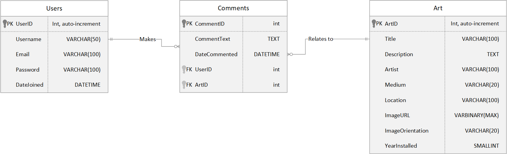

### Explanation of Relationships:

- **Users to Comments (1-to-Many):**

  - Each user (Users table) can have multiple comments (Comments table).
  - The relationship is represented by the UserID in the Comments table as a foreign key linking back to the Users table.

- **Art to Comments (1-to-Many):**
  - Each artwork (Art table) can have multiple comments (Comments table).
  - The relationship is represented by the ArtID in the Comments table as a foreign key linking back to the Art table.

## Snapshots of the CMS:

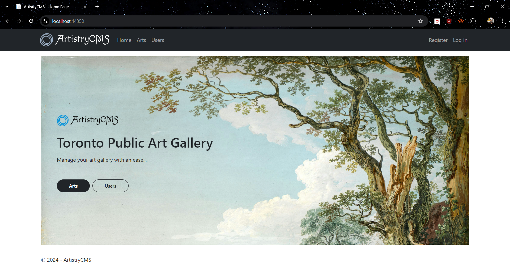
*Landing Page*

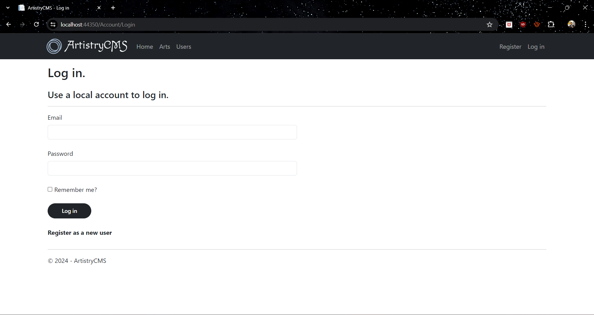
*Login Page*

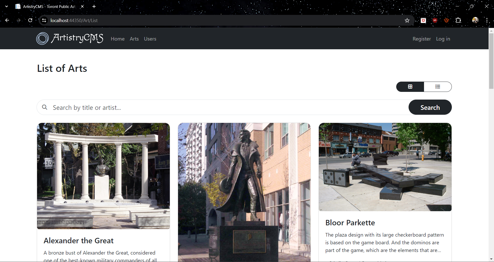
*Art Lists*

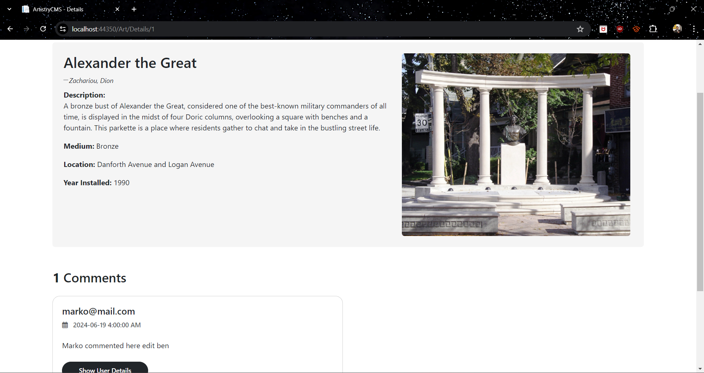
*Art Details Page*

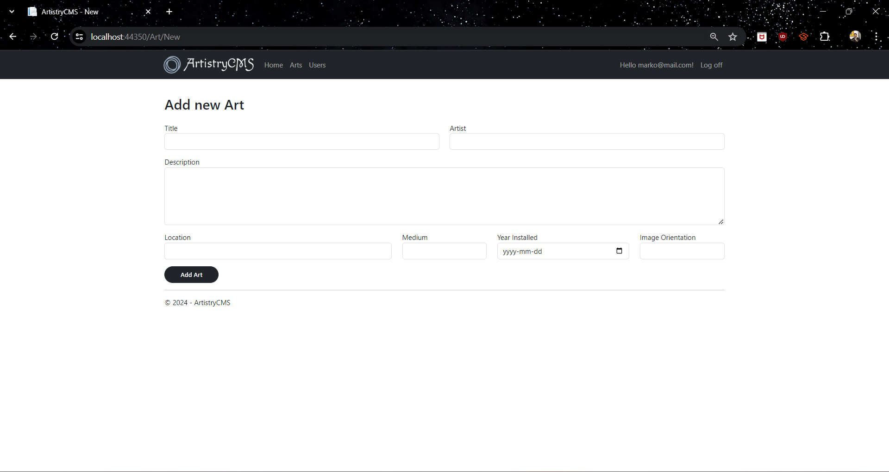
*Add Art Page*

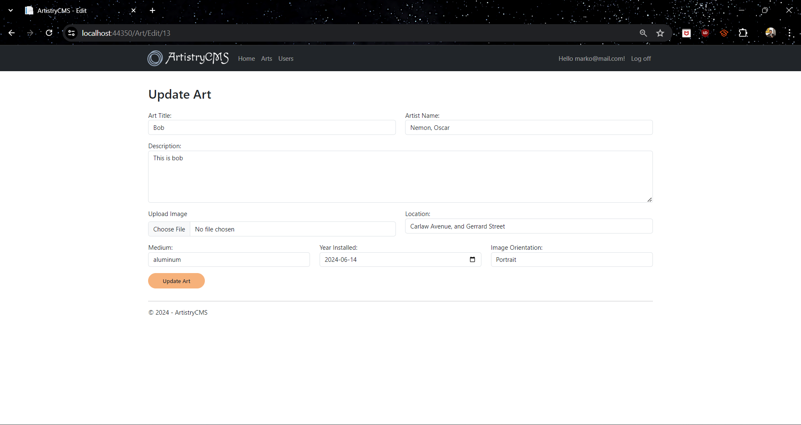
*Update Art Page*

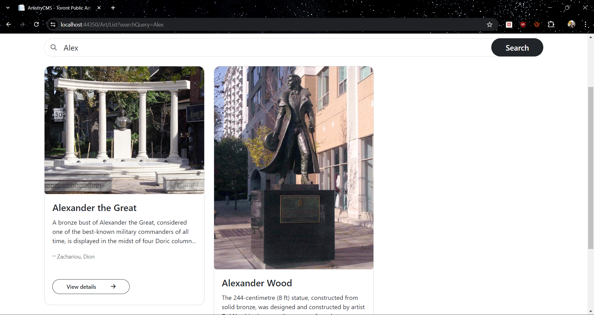
*Search Page*

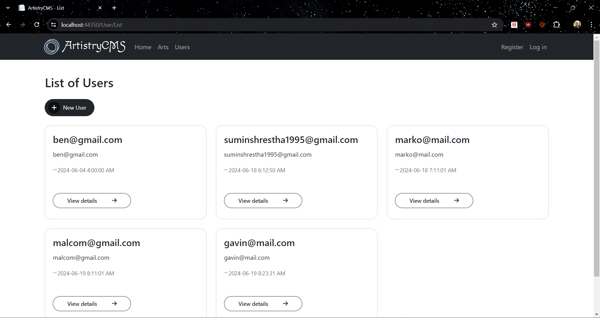
*User List Page*

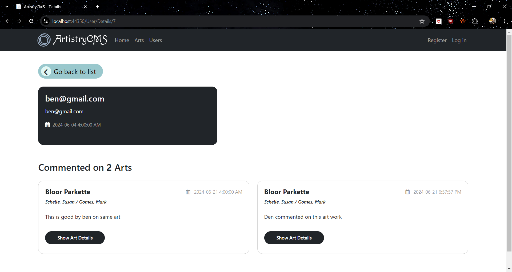
*User Details Page*

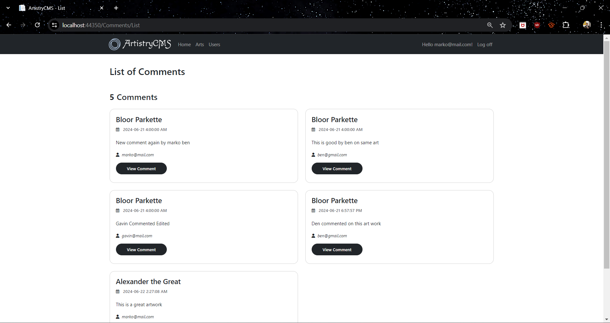
*Comments List Page*

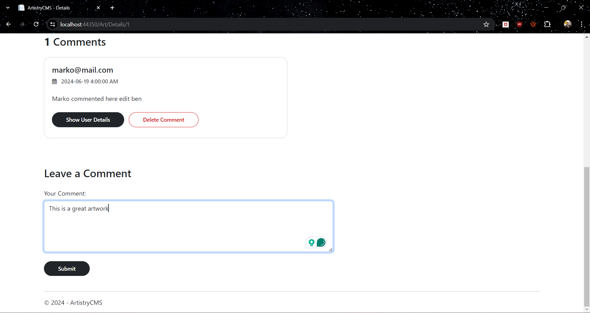
*Comment Add Page*

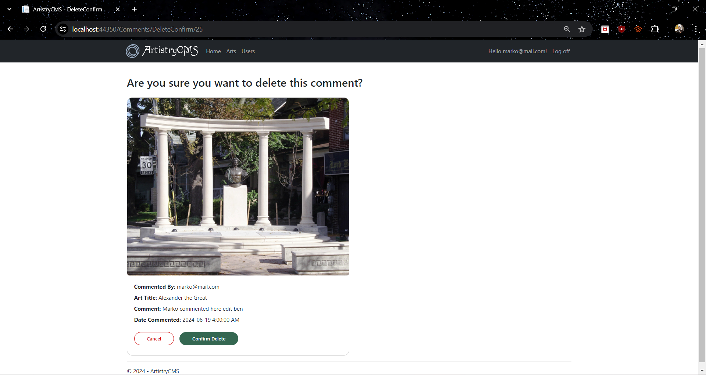
*Comment Delete Page*

